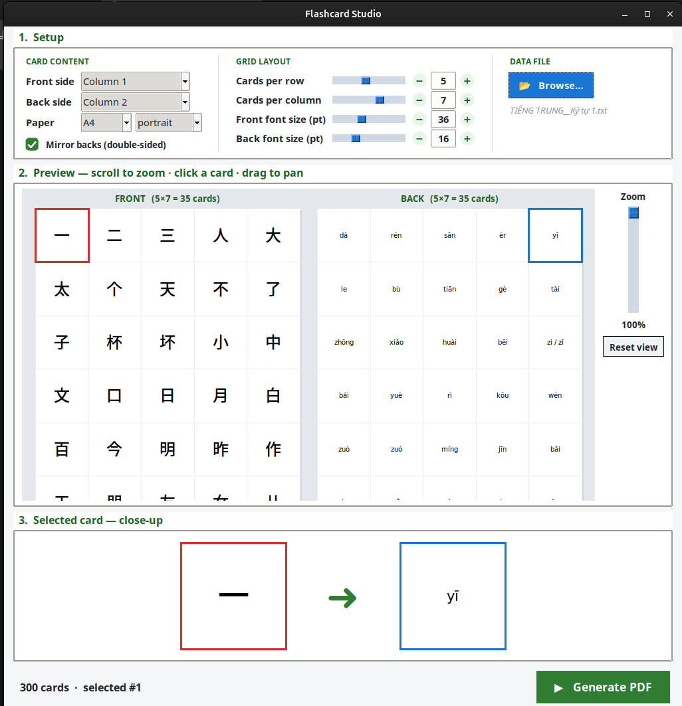

<div align="center">

# 🎴 Flashcard Studio

**Turn a spreadsheet of words into printable, double-sided PDF flashcards — in seconds.**

[](https://www.python.org/)
[](LICENSE)
[](.)

*Built for language learners who want paper, not another screen.*

</div>

---

## ✨ Why this exists

Digital flashcard apps are great — until you want to actually **touch** the cards, cut them out, and study without a phone in your hand.

Flashcard Studio takes a plain list of words and their translations and generates a print-ready, double-sided PDF. Front = word. Back = meaning. Cut along the lines. Start learning.

No accounts. No cloud. No browser extensions. Just a Python script and a PDF.

---

## 📸 Screenshot



---

## 🚀 Features

| | |
|---|---|
| 📂 **Flexible input** | Load `.txt`, `.csv`, or `.xlsx` files |
| 🎯 **Custom mapping** | Choose which column goes on the front, which on the back |
| 📐 **Full-page grid** | Set cards per row / per column — cards fill the entire A4 sheet with zero wasted space |
| 🔤 **Independent font sizing** | Front and back text sizes are tuned separately |
| 🔍 **Live preview** | Scroll to zoom, drag to pan, click any card to inspect it up close |
| 🖨️ **Print-ready output** | Clean, cut-aligned PDF with mirrored backs for double-sided printing |
| 🌏 **Unicode-native** | Chinese, Japanese, Korean, Vietnamese, pinyin with tone marks — all render correctly |

---

## ⚡ How to use

### Step 1 — Install once

Open a terminal and paste this line, then press Enter:

```bash
sudo apt install python3-tk python3-reportlab python3-pil python3-openpyxl fonts-dejavu
